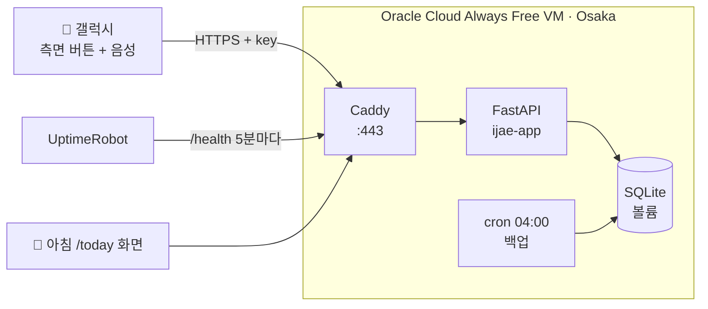

# 🍼 음성 수유 기록 (Voice Feeding Log)

> 밤중 수유 중 두 손이 없어도, **말 한마디로** 수유·기저귀를 기록하고
> 아침에 육아 앱(베이비타임)에 쉽게 옮겨 적을 수 있게 만든 개인 프로젝트

## 왜 만들었나
- 육아 앱 "베이비타임"은 기록할 때마다 폰을 켜고 여러 번 눌러야 함
- 새벽 수유 중엔 한 손엔 아기, 다른 손은 쓸 수 없어서 기록을 놓치거나 아침에 기억에 의존
- 갤럭시 베이비타임은 외부 연동(API·단축어)을 지원하지 않음 → **직접 음성 기록 파이프라인을 구축**

## 동작 방식
```
측면 버튼 두 번 → "왼쪽 다 먹었어" (음성)
  → MacroDroid: 음성을 글자로 변환 → HTTPS 요청
  → Caddy (HTTPS, 인증서 자동 발급)
  → FastAPI (비밀 키 인증 → 문장 해석 → SQLite 저장)
  → 아침: /today 화면을 보고 베이비타임에 입력 → "입력 완료" 체크
```



## 기술 스택
| 영역 | 사용 기술 |
|---|---|
| 백엔드 | Python, FastAPI, SQLite |
| 인프라 | Oracle Cloud (Always Free VM, VCN, Security List) |
| 컨테이너 | Docker, Docker Compose |
| 네트워크/보안 | Caddy (리버스 프록시 + Let's Encrypt 자동 HTTPS), DuckDNS, iptables, API Key 인증 |
| 운영 | cron 일일 백업(30일 보관), UptimeRobot 헬스체크 모니터링 |
| 클라이언트 | MacroDroid (측면 버튼 → 음성 입력 → HTTP 요청) |

## 주요 기능
- **자유 문장 해석**: "밥 먹는다 / 왼쪽 다 먹었어 / 오른쪽 끝 / 똥 쌌어" → 수유 시작·좌우 종료·기저귀로 분류 (오타에도 동작)
- **자동 계산**: 좌우 수유 시간 계산, 양쪽 다 먹으면 자동 종료, 1시간 무응답 시 자동 마감
- **/today 화면**: 베이비타임 입력 칸 순서 그대로 카드 표시, 입력 완료 체크, 삭제
- **못 알아들은 문장** 별도 표시 → 개선 자료로 활용

## API
| Method | Path | 설명 |
|---|---|---|
| POST | `/log` | 음성 문장 저장 `{"text": "왼쪽 다 먹었어"}` |
| GET | `/today` | 베이비타임 옮겨 적기용 모바일 화면 |
| GET | `/summary` | 최근 기록 요약 (텍스트) |
| POST | `/done/{id}` | 입력 완료 체크 토글 |
| POST | `/delete/{id}` | 기록 삭제 |
| GET | `/health` | 헬스체크 (인증 없음) |

모든 요청은 `?key=` / `X-Key` 헤더 / 쿠키 중 하나로 비밀 키 필요 (`/health` 제외)

## 실행 방법
```bash
cp .env.example .env        # DOMAIN, API_KEY 채우기
docker compose up -d --build
```

## 트러블슈팅 기록
| 문제 | 원인 | 해결 |
|---|---|---|
| 빅스비 "빠른 명령어" 메뉴가 없음 | One UI 7부터 기능 제거 | 측면 버튼 두 번 → 앱 실행 트리거로 대체 |
| MacroDroid 알림에 `{v=said}` 글자 그대로 표시 | 매크로 전용 변수는 `{lv=}` 문법 | `{lv=said}` 로 수정 |
| A1(ARM) 인스턴스 생성 실패 | Osaka 리전 무료 ARM 용량 부족 (Out of capacity) | E2.1.Micro(AMD)로 변경 + 2GB 스왑 추가 |
| 인스턴스 생성 시 서브넷 선택 불가 | 인라인 VCN 생성 UI 문제 | VCN 마법사로 인터넷 연결 VCN 먼저 생성 |
| 서버 안에선 200, 외부에선 연결 안 됨 | 인스턴스가 속한 서브넷의 Security List에 80/443 Ingress 규칙 누락 | 올바른 Security List에 규칙 추가 |
| iptables 허용 규칙이 무효 | ACCEPT 규칙이 REJECT 규칙 뒤에 삽입됨 | 규칙 번호 확인 후 REJECT 앞으로 재삽입 |
| 폰에서 기록 401 | 매크로 URL의 API 키 한 글자 누락 | 서버 로그로 키 비교 후 수정 |
| 배포 직후 `/.env`, `/config.json` 요청 다수 | 인터넷 봇의 민감 파일 탐색 | API 키 인증으로 전부 401 차단 확인 |

## 다음 계획
- [ ] 아이폰 단축어 지원 + 베이비타임 단축어 동작으로 자동 입력
- [ ] 갤럭시: Automate로 베이비타임 자동 입력
- [ ] 키워드로 못 알아들은 문장만 LLM으로 해석 (폴백 구조)
- [ ] 가족별 계정 분리 (멀티 유저)
